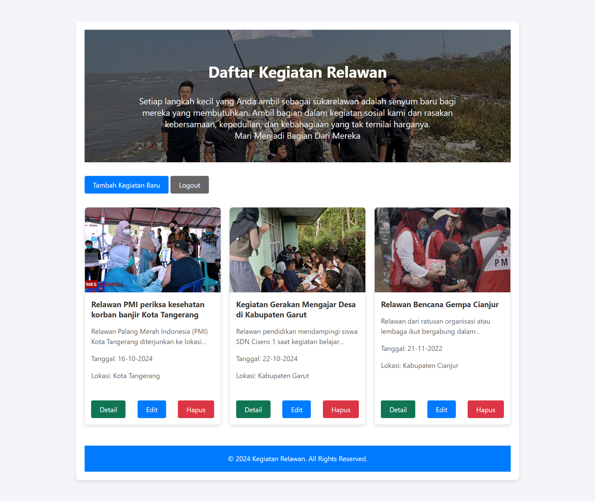

# 🤝 Aplikasi Kegiatan Relawan 🌍

Selamat datang di **Aplikasi Kegiatan Relawan**! 🎉 
Aplikasi ini memudahkan Anda dalam mengelola kegiatan sosial dan relawan. Pengguna dapat dengan mudah menambah, mengedit, serta melihat kegiatan relawan yang telah terdaftar. 🌟

## 🚀 Fitur Utama

- **Daftar Kegiatan Relawan**: Pengguna dapat melihat daftar semua kegiatan yang tersedia.
- **Tambah Kegiatan**: Pengguna dapat menambahkan kegiatan relawan baru.
- **Edit Kegiatan**: Pengguna dapat memperbarui informasi kegiatan relawan yang sudah ada.
- **Detail Kegiatan**: Pengguna dapat melihat informasi lengkap setiap kegiatan.
- **Tampilan Responsif**: Antarmuka yang mudah digunakan dan terlihat baik di berbagai perangkat.

## 📄 Halaman Aplikasi

### 1. Halaman index.php - Form Daftar Masuk Pengguna
Halaman ini adalah halaman awal di mana pengguna dapat melakukan login untuk mengakses fitur-fitur aplikasi. Setelah login berhasil, pengguna akan diarahkan ke halaman utama.

### 2. Halaman home.php - Daftar Semua Kegiatan Relawan
Di halaman ini, pengguna dapat melihat semua kegiatan relawan yang tersedia. Setiap kegiatan ditampilkan dalam bentuk kartu dengan informasi singkat seperti nama kegiatan, deskripsi singkat, tanggal, dan lokasi.

### 3. Halaman tambah_kegiatan.php - Form Tambah Kegiatan
Pada halaman ini, pengguna yang memiliki izin dapat menambahkan kegiatan baru dengan mengisi detail kegiatan seperti nama, deskripsi, tanggal, lokasi, dan mengunggah dokumentasi.

### 4. Halaman edit_kegiatan.php - Form Edit Kegiatan
Halaman ini memungkinkan pengguna untuk mengedit informasi kegiatan yang sudah ada. Pengguna dapat memperbarui deskripsi, tanggal, lokasi, dan informasi lainnya.

### 5. Halaman detail_kegiatan.php - Lihat Detail Lengkap Kegiatan
Di halaman ini, pengguna dapat melihat informasi lengkap tentang kegiatan yang dipilih. Detail kegiatan mencakup nama, deskripsi lengkap, tanggal, lokasi, dan dokumentasi.

## 📚 Teknologi yang Digunakan

- **HTML5**: Untuk struktur halaman.
- **CSS3**: Untuk tampilan antarmuka yang menarik.
- **PHP**: Mengelola logika backend dan interaksi dengan database.
- **MySQL**: Menyimpan dan mengelola data kegiatan relawan.

---

# 🙏 Terima Kasih Telah Menggunakan Aplikasi Kegiatan Relawan! 🙏

Kami berharap aplikasi ini mempermudah Anda dalam mengelola kegiatan relawan. Jangan lupa untuk memberikan **like** dan **share** aplikasi ini agar semakin banyak yang terlibat dalam kegiatan sosial! 😊
